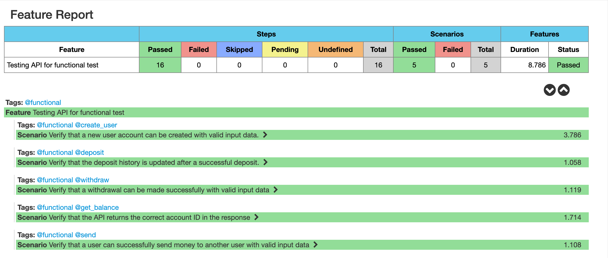

# AutomationBySuleyman

This project contains 

API Test Automation of the [Postman Mock Server virtualization of ExBanking](https://b959fb5c-eda5-4f0e-91cc-10e028da0682.mock.pstmn.io)

This project is developed with Java on IntelliJ.

## This test contains these libraries and techniques

**Maven** as builder

**JUnit** as test tool

**JUnit, Hamcrest Matchers** as asserting tool

**Cucumber** with **Gherkin** Language as **BDD** tool

**Log4J** as logging tool

**RESTAssured** as api test tool

**POJO** for data representation and manipulation

**Java 11** as JDK

**Project Lombok** as boiler plate code wrapper

## Fancy Cucumber HTML reports

